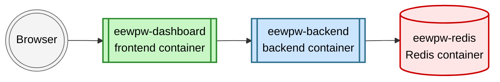

## Redis Configuration Notes


EEWPW supports two Redis configurations: 
- **Bundled Redis** (default): No `REDIS_URL` is needed; Compose runs Redis automatically. Make sure the `REDIS_URL` is commented out in your `.env` file. 

- **External Redis**:  Uncomment and set `REDIS_URL` in `.env`, for example:  
  `REDIS_URL=redis://host.docker.internal:6379/0`  
  
The only difference is that **bundled** mode starts a Redis container automatically, while **external** mode assumes you already have a Redis server running; hence, skips Redis installation steps.


---


### Why these two modes?

EEWPW supports both bundled and external Redis because development and operational workflows have different needs. EEWPW is a multi-component software. The `frontend` (dashboard you see on your browser) relies on the `backend` (server side), and the `backend` requires a Redis server running along as service for storing, caching and serving data to the `frontend`. 




Especially when actively developing the backend component, a developer would make frequent code updates, then build the docker container to test the code. This is time consuming and testing becomes more complex. A much faster alternative is to run the backend directly using the Python interface. This is only possible when there is already a Redis server running. 

Developers often run Redis separately —for example on the host— to inspect keys, flush state, or run the backend repeatedly without restarting containers. Production-like users, on the other hand, do not need it. They benefit from the fully self‑contained Docker stack where Redis is started automatically via `docker-compose.yml`.  

These two modes ensure flexibility: smooth local development without container builds/restarts, and predictable deployments for standard users.


---


### How to find out if you have the Redis container

EEWPW’s bundled Redis container is named **`eewpw-redis`**. To check whether it exists or is running, use the commands below.

List all containers, including stopped ones (works on **macOS, Linux, and Windows PowerShell**):

```bash
docker ps --all
```

Or, filter specifically for the Redis container

```bash
docker ps --all --filter "name=eewpw-redis"
```

If the bundled Redis container is present, you will see something like:

```bash
eewpw-redis   "docker-entrypoint.sh…"   ...   0.0.0.0:6379->6379/tcp
```

If you do not see any `eewpw-redis` container, then the bundled Redis is not running.  
In this case, EEWPW will only work if:

- you start the bundled Redis via `make up`, **or**
- you run your own external Redis instance and set `REDIS_URL` in `.env`.


---


### What happens if you do it wrong in the `.env` file?

**Absolutely no harm!** 

If the Redis mode is misconfigured (for example, the wrong `REDIS_URL` setting for the compose file you are using), nothing breaks permanently — EEWPW will simply run in the *wrong mode*.

Common symptoms include:
- The backend repeatedly shows `Cannot connect to Redis` in logs.
- The dashboard loads but never receives backend data.
- The system appears "stuck" even though containers are healthy.
- You had Redis previously, but used `make up` for the bundled mode: You will see `eewpw-redis already exists` error.

In all these cases, the solution is simple:

1. **Switch to the correct mode**  
   - If you intended to use bundled Redis → comment out `REDIS_URL` and run `make up`.
   - If you intended to use external Redis → set `REDIS_URL=redis://…` and run `make up COMPOSE_FILE=docker-no-redis-compose.yml`.

2. **If changes do not take effect**, recreate containers:
   ```bash
   make down
   make up
   ```

Nothing else is required — no cleanup, no reinstall, no data loss. You were simply in the wrong Redis mode.

---

### Switching Between Redis Modes

| Switching to…        | `.env` change required | `make down` required? |
|----------------------|------------------------|-----------------------|
| **Bundled Redis**    | Comment out `REDIS_URL` | Sometimes. Needed only if backend keeps a stale env value. |
| **External Redis**   | Set `REDIS_URL=redis://…` | No. `make up COMPOSE_FILE=docker-no-redis-compose.yml` is enough. |


More explicitly, when using external Redis

```bash
# Uncommented URL
REDIS_URL=redis://host.docker.internal:6379/0
```

```bash
make up COMPOSE_FILE=docker-no-redis-compose.yml
```

When using bundled Redis

```bash
# No need - comment out
# REDIS_URL=redis://host.docker.internal:6379/0
```

```bash
make up
```

If the backend still connects to the old Redis URL:

```bash
make down
make up
```

**Important Notes**

- Compose decides which services run.  
- The backend selects Redis based on `.env`.  
- If `REDIS_URL` is set → bundled Redis is ignored.  
- If `REDIS_URL` is commented → external Redis is not used.
- EEWPW never runs with both Redis instances.
- The `.env` always wins over the compose files.

